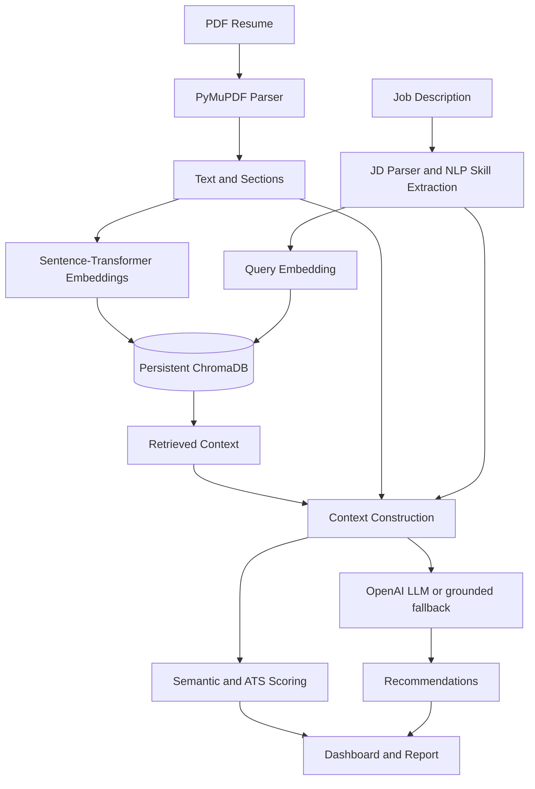

# AI Resume Analyzer

**RAG-powered AI Resume Analyzer that uses NLP, semantic embeddings, vector search, and LLMs to evaluate resume-job compatibility, identify skill gaps, analyze ATS readiness, and generate contextual resume recommendations.**

## Overview

This project is a working Streamlit application for comparing a PDF resume with a target job description. It extracts resume text and sections, detects skills from the supplied evidence, computes embedding-based similarity, persists curated guidance in ChromaDB, retrieves relevant guidance, and passes that retrieved context to an optional LLM. When no API key is configured, the app remains usable with a grounded local fallback rather than pretending that an LLM was called.

## Architecture



## RAG implementation

The RAG path is explicit: knowledge-base Markdown files are chunked and embedded; ChromaDB stores the vectors and metadata; a job-derived query performs similarity retrieval; `format_context` constructs the evidence block; and `generate_recommendations` refuses to generate when retrieved context is empty. The dashboard exposes source, section, similarity, and snippet for every retrieved chunk.

## Features

| Capability | Implementation |
|---|---|
| Resume parsing | PyMuPDF text extraction, sections, contact fields |
| Job analysis | Section detection and evidence-based skill extraction |
| Embeddings | Sentence Transformers `all-MiniLM-L6-v2` |
| Vector database | Persistent ChromaDB with source metadata |
| Matching | Cosine semantic similarity plus skill coverage |
| ATS | Measurable section, contact, formatting, keyword, and relevance checks |
| Generation | Configurable OpenAI JSON response with grounded fallback |
| Output | Streamlit dashboard and downloadable Markdown report |

## Installation

```bash
git clone <your-repository-url>
cd ai-resume-analyzer
python -m venv .venv
source .venv/bin/activate
pip install -r requirements.txt
cp .env.example .env
streamlit run app.py
```

The first embedding-model use may download the model from Hugging Face. Set `OPENAI_API_KEY` in `.env` to enable generated prose; do not commit `.env`.

## Scoring methodology

The overall match is calculated from actual embeddings and input evidence: 45% normalized resume-job semantic similarity, 30% job-skill coverage, 10% resume length as a limited experience proxy, 10% project relevance, and 5% education evidence. ATS readiness combines detected job-keyword coverage, required sections, formatting checks, job relevance, and contact completeness. These are transparent heuristics, not hiring decisions.

## Privacy and limitations

The app does not write uploaded resumes to disk. ChromaDB contains curated knowledge-base vectors by default; do not index personal documents in a shared directory. PDF scans without a text layer require OCR, which is intentionally reported rather than guessed. Skill extraction uses a transparent taxonomy and does not claim to discover every possible skill. LLM recommendations are advisory and should be reviewed for factual accuracy.

## Tests

```bash
pytest -q
```

## Future improvements

OCR for scanned PDFs, configurable taxonomies, multilingual embeddings, richer partial-match relationships, database-backed user workspaces with explicit retention controls, and calibration against labeled resume-job datasets are appropriate next steps.

## Author

Manus AI
